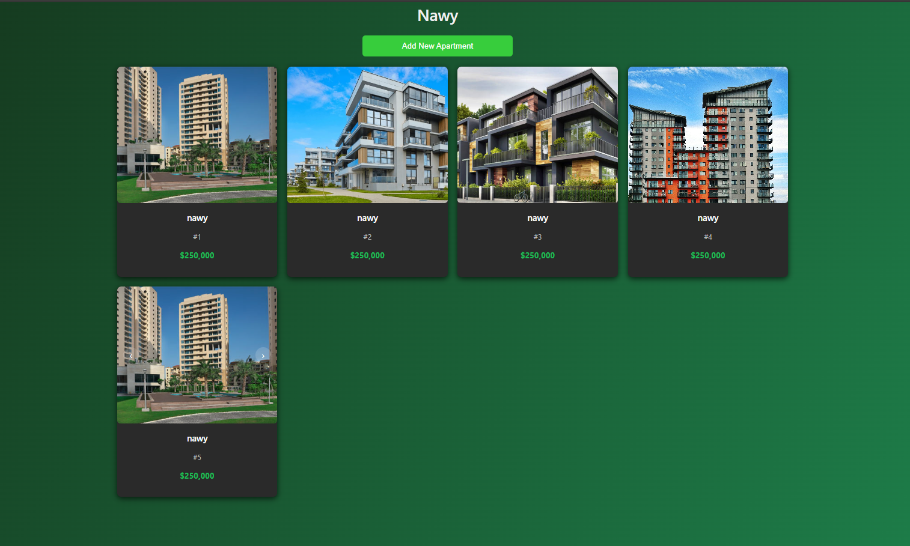
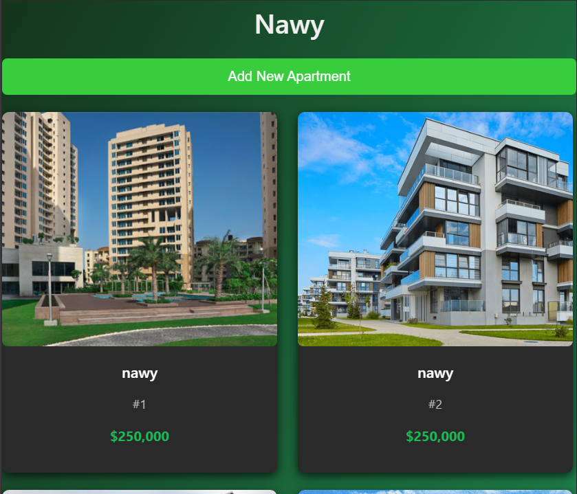

# Nawy Apartment Manager

A full-stack apartment management web application built with:

- **Backend:** Django (Python)
- **Frontend:** React (Vite)
- **Containerized with:** Docker & Docker Compose

---

## Features

- Create new apartments with detailed information, including name, unitname, and support for uploading multiple images
- Browse a responsive list of all apartments, optimized for both mobile and desktop devices
- View comprehensive apartment details, featuring image galleries and full property information

---

## Prerequisites

- [Docker](https://www.docker.com/)
- [Docker Compose](https://docs.docker.com/compose/)

> Ensure Docker Desktop is running.

---

## Project Structure

```
nawy-apartment-manager/
├── backend/               # Django backend
├── frontend/              # React frontend
├── Dockerfile.backend     # Backend Docker config
├── Dockerfile.frontend    # Frontend Docker config
├── docker-compose.yml     # Docker Compose config
└── README.md              # This documentation
```


---

## Installation

### 1. Clone the Repository

```bash
git clone https://github.com/Esammohammed/nawy-apartment-manager.git
git checkout master
cd nawy-apartment-manager
```
### 2. Build and Run the Application

```bash
docker-compose up --build
```
### 3. Access the Application
- **Frontend:** Open your browser and navigate to `http://localhost:5173`
- **Backend:** Open your browser and navigate to `http://localhost:8000`


### 4. Stop the Application
To stop the application, press `CTRL + C` in the terminal where Docker Compose is running. You can also run:

```bash
docker-compose down
```

---
### 5. Screenshots

#### Apartment List


#### Apartment List Responsive (Mobile)


#### Add Apartment Form


####  Apartment Details & Navigating Apartment Images 


## License

This project is licensed under the [MIT License](LICENSE).
